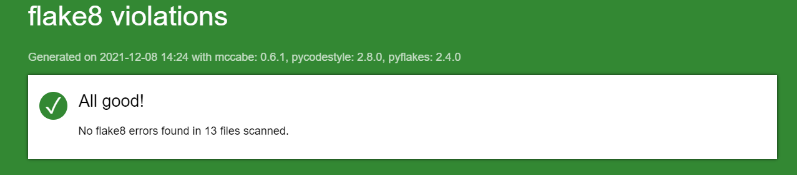
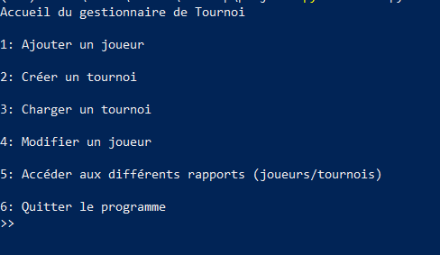

# PROJET_4
Projet 4, logiciel de gestion de tournois d'échecs


## Deploiement

Pour installer le projet 
```bash
  git clone https://github.com/YoucefCudder/PROJET_4.git
```


```bash
cd PROJET_4
python -m venv env 
env\scripts\activate
```
Installer les paquets requis :
```bash
pip install -r requirements.txt
```
Lancer le programme : 

```bash
python main.py
```

## Rapport Flake8 
 Pour générer un rapport flake8
```bash
 flake8 --format=html --htmldir=flake8_report
```
voici le dernier rapport flake8 :



## Menu d'accueil : 



